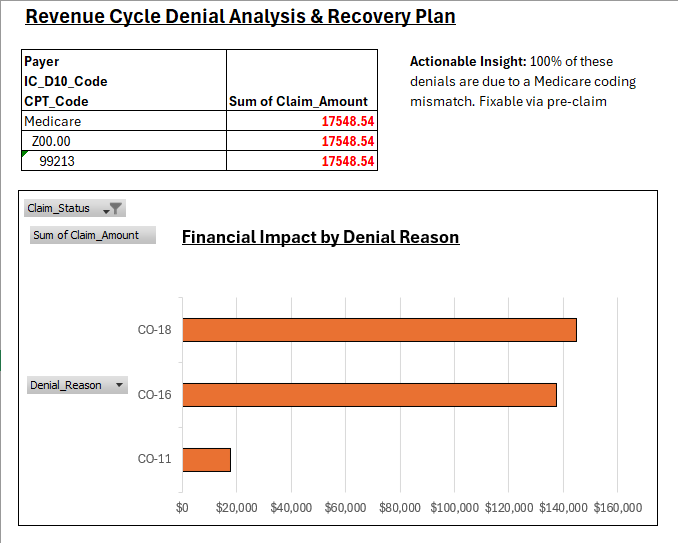

# Healthcare Revenue Cycle & Denial Analysis

### **Project Overview**
**Business Problem:** The healthcare provider network was experiencing a **16% denial rate**, leading to delayed cash flow and increased administrative rework costs. The objective was to identify the root causes of denials and propose a data-driven solution to recover lost revenue.

**Goal:** Analyze 5,000+ claims records to pinpoint specific coding or operational bottlenecks and reduce Accounts Receivable (AR) days.

---

### **Executive Dashboard**

*(See full PDF report: [Dashboard_Preview.pdf](Dashboard_Preview.pdf))*

---

### **Key Findings**
After analyzing the dataset, three critical insights emerged:

1.  **The "Hidden" Cost:** While `CO-18` (Duplicate Claims) had the highest volume, `CO-11` (Medical Necessity) represented the most significant *fixable* revenue loss.
2.  **Root Cause Discovery:** Using SQL analysis, I isolated a systematic logic error: **100% of 'Medical Necessity' denials** came from Medicare when CPT Code `99213` (Office Visit) was paired with ICD-10 `Z00.00` (General Exam).
3.  **Financial Impact:** This single coding mismatch pattern accounted for **$17,500+** in lost revenue within the sample dataset (projected **$50k+ annually**).

### **Technical Approach**
* **Data Processing:** Cleaned and standardized raw claims data using **Python (Pandas)**.
* **Analysis:** Utilized **SQL** for pattern recognition and grouping (identifying the CPT/ICD-10 correlation).
* **Visualization:** Built an interactive **Excel Dashboard** to visualize Payer Mix and AR Aging buckets.

### **Proposed Solution (The "Fix")**
To resolve the $50k revenue leakage, I proposed a **Pre-Claim Validation Rule**:
> **Logic:** `IF Payer = 'Medicare' AND CPT = '99213' AND ICD-10 = 'Z00.00' THEN Flag for Review.`

Implementing this logic upstream would prevent the denial before submission, reducing Days in AR by an estimated 5-7 days.

---

### **Files Included**
* `Healthcare_Revenue_Cycle_Analysis.xlsx`: The interactive dashboard and raw data pivot tables.
* `analysis.sql`: The SQL queries used to identify the specific denial correlations.
* `Dashboard_Preview.pdf`: A high-resolution export of the executive summary.
